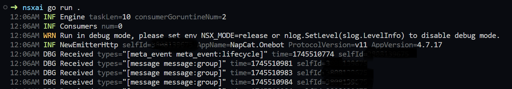
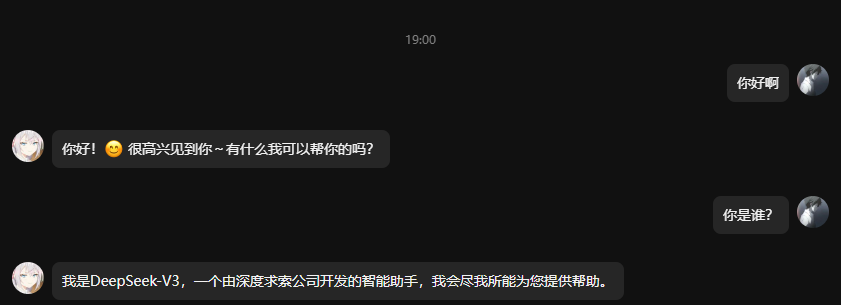

# 写一个聊天机器人吧

## 创建项目
```bash
mkdir nsxai
cd ./nsxai
go mod init nsxai
```
## 添加依赖
```bash
go get -u github.com/nsxdevx/nsxbot
```
## 连接到OneBot
这里采用的是将OneBot实现作为WServer, 我们主动去连接.
```go
package main

import (
	"context"
	"time"

	nsx "github.com/nsxdevx/nsxbot"
	"github.com/nsxdevx/nsxbot/driver"
)

func main() {
	driver := driver.NewWSClient(1*time.Second, driver.WSnode{
		Url: "localhost:4000",
	})
	bot := nsx.Default(driver)
	bot.Run(context.Background())
}
```
运行，应该在控制台看到如下输出


## 测试消息交互
```go
func main() {
	driver := driver.NewWSClient(1*time.Second, driver.WSnode{
		Url: "localhost:4000",
	})
	bot := nsx.Default(driver)
	pvt := nsx.OnEvent[types.EventPvtMsg](bot)

	adminuin, _ := strconv.ParseInt(os.Getenv("ADMIN_UIN"), 10, 64)
	pvt.Handle(func(ctx *nsx.Context[types.EventPvtMsg]) {
		ctx.Msg.Reply(ctx, "测试")
	}, filter.OnlyUsers(adminuin))

	bot.Run(context.Background())
}
```
现在尝试使用admin的qq发送一条消息到你的Bot，正常的话，你会收到“测试”的回复
## 对接大语言模型
安装openai-go
```bash
go get -u github.com/openai/openai-go
```
对接到Reply
```go
func main() {
	driver := driver.NewWSClient(1*time.Second, driver.WSnode{
		Url: "localhost:4000",
	})
	bot := nsx.Default(driver)
	pvt := nsx.OnEvent[event.PrivateMessage](bot)

	adminuin, _ := strconv.ParseInt(os.Getenv("ADMIN_UIN"), 10, 64)
	baseUrl := os.Getenv("NEWAPI_BASEURL")
	key := os.Getenv("NEWAPI_KEY")

	client := openai.NewClient(option.WithAPIKey(key), option.WithBaseURL(baseUrl))

	pvt.Handle(func(ctx *nsx.Context[event.PrivateMessage]) {
		msg := ctx.Msg
		text, err := msg.TextFirst()
		if err != nil {
			msg.Reply(ctx, "请输入文本")
			return
		}
		chatCompletion, err := client.Chat.Completions.New(ctx, openai.ChatCompletionNewParams{
			Messages: []openai.ChatCompletionMessageParamUnion{
				openai.UserMessage(text.Text),
			},
			Model: "deepseek-v3",
		})
		if err != nil {
			msg.Reply(ctx, "openai出错了!"+err.Error())
			return
		}
		msg.Reply(ctx, chatCompletion.Choices[0].Message.Content)
	}, filter.OnlyUsers(adminuin))

	bot.Run(context.Background())
}
```
## 完成！

